# UML Use Case Diagrams

Use case diagrams documenting the user-facing functionality of each top-level script.

---

## `createTiledDataset.py`

Crops large orthorectified images into fixed-size tiles for use as training/validation data.


### Key Behaviors

| Argument | Required | Default | Description |
|---|---|---|---|
| `--raw_data_dir` | Yes | — | Directory containing source images to tile |
| `--save_data_dir` | Yes | — | Directory where tiles will be written |
| `--file_extension` | No | `png` | File extension used to glob input images |
| `--overlap_ratio` | No | `0.2` | Fractional overlap between adjacent tiles (0 = no overlap) |
| `--crop_width` | No | `600` | Tile width in pixels |
| `--crop_height` | No | `600` | Tile height in pixels |

**Output filename pattern:** `{original_name}_{index:06d}.png`
**Side effect:** Output directory is created automatically if it does not exist.

---

## `createTiledDataset.py` — Data Flow Diagram

Shows how data moves through the script from CLI inputs to tile files on disk.

```mermaid
flowchart LR
    %% ── External entities ──────────────────────────────────────────────
    USER(["User (CLI)"])
    RAW[("raw_data_dir/\ne.g. data/coregistered_images/on/\n─────────────────\nimage001.png\nimage002.png\n…")]
    OUT[("save_data_dir/\ne.g. data/training_pairs/on/\n─────────────────\nimage001_000000.png\nimage001_000001.png\n…")]

    %% ── Processes ───────────────────────────────────────────────────────
    P1["1 · Parse CLI Arguments"]
    P2["2 · Glob Image Files\nos.path.join(raw_data_dir,\n'*.file_extension')"]
    P3["3 · Load Image & Read Dims\nImage.open → np.asarray\n→ h, w, c"]
    P4["4 · Generate Tile Origins\nnested while loops\ncurr_h, curr_w"]
    P5["5 · Crop Tile Region\nimg.crop(curr_w, curr_h,\ncurr_w+W, curr_h+H)"]
    P6["6 · Construct Tile Filename\nname = basename.split('.')[0]\nfileNo = str(filecount).zfill(6)\nfilename = name + '_' + fileNo + '.png'"]
    P7["7 · Save Tile\ncropped.save(save_data_dir/filename)"]

    %% ── User inputs ─────────────────────────────────────────────────────
    USER -->|"--raw_data_dir\n--save_data_dir\n--file_extension  (default: png)\n--overlap_ratio  (default: 0.2)\n--crop_width     (default: 600)\n--crop_height    (default: 600)"| P1

    %% ── Config fans out ─────────────────────────────────────────────────
    P1 -->|"raw_data_dir, file_extension"| P2
    P1 -->|"crop_width W, crop_height H\noverlap_ratio"| P4
    P1 -->|"save_data_dir"| P7

    %% ── File discovery ──────────────────────────────────────────────────
    RAW -->|"matching file paths"| P2
    P2 -->|"file path"| P3
    P2 -->|"file path\n(for name extraction)"| P6

    %% ── Image pipeline ──────────────────────────────────────────────────
    P3 -->|"PIL Image object"| P4
    P3 -->|"PIL Image object"| P5
    P4 -->|"(curr_w, curr_h)\ntile origin coords"| P5
    P4 -->|"filecount\n(resets to 0 per source image)"| P6

    %% ── Stride formula ──────────────────────────────────────────────────
    P4 -. "stride = dim × (1 − overlap_ratio)\ne.g. 600 × 0.8 = 480 px" .-> P4

    %% ── Output assembly ─────────────────────────────────────────────────
    P5 -->|"cropped pixel data\n(W × H px)"| P7
    P6 -->|"tile filename\ne.g. image001_000003.png"| P7
    P7 -->|"tile PNG file"| OUT
```



### Filename Convention

Tiles are named by combining the source image stem with a zero-padded tile index that resets to `000000` for each source image:

```
{source_stem}_{tile_index:06d}.png

Example
  Source file : data/coregistered_images/on/image001.png
  Tile 0      : data/training_pairs/on/image001_000000.png
  Tile 1      : data/training_pairs/on/image001_000001.png
  Tile N      : data/training_pairs/on/image001_{N:06d}.png
```

### Tile Grid Layout

Tiles are generated in row-major order (left-to-right, top-to-bottom). Only tiles that fit entirely within the source image boundary are kept — any remainder pixels at the right or bottom edge are silently dropped.

```
stride = dimension × (1 − overlap_ratio)

Example: 600 px tile, overlap_ratio = 0.2
  stride = 600 × (1 − 0.2) = 480 px

Grid origins (col × row):
  (0,0)   (480,0)   (960,0)   …
  (0,480) (480,480) (960,480) …
  …
```

---
