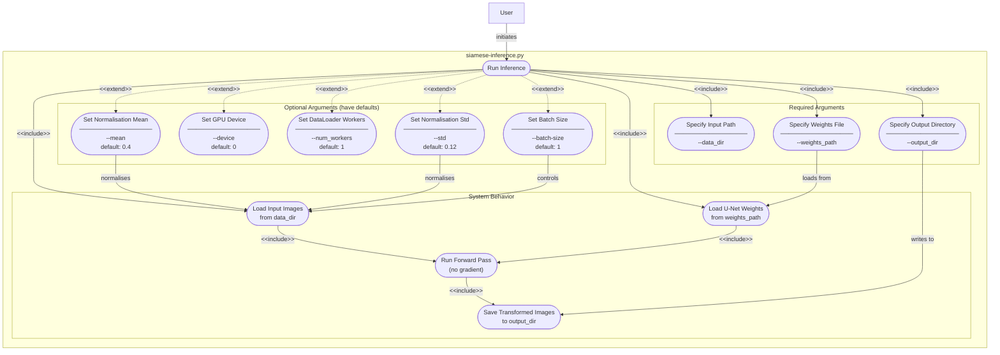

# UML Use Case Diagrams

Use case diagrams documenting the user-facing functionality of each top-level script.

---

## `createTiledDataset.py`

Crops large orthorectified images into fixed-size tiles for use as training/validation data.


### Key Behaviors

| Argument | Required | Default | Description |
|---|---|---|---|
| `--raw_data_dir` | Yes | — | Directory containing source images to tile |
| `--save_data_dir` | Yes | — | Directory where tiles will be written |
| `--file_extension` | No | `png` | File extension used to glob input images |
| `--overlap_ratio` | No | `0.2` | Fractional overlap between adjacent tiles (0 = no overlap) |
| `--crop_width` | No | `600` | Tile width in pixels |
| `--crop_height` | No | `600` | Tile height in pixels |

**Output filename pattern:** `{original_name}_{index:06d}.png`
**Side effect:** Output directory is created automatically if it does not exist.

---

## `createTiledDataset.py` — Data Flow Diagram

Shows how data moves through the script from CLI inputs to tile files on disk.


### Filename Convention

Tiles are named by combining the source image stem with a zero-padded tile index that resets to `000000` for each source image:

```
{source_stem}_{tile_index:06d}.png

Example
  Source file : data/coregistered_images/on/image001.png
  Tile 0      : data/training_pairs/on/image001_000000.png
  Tile 1      : data/training_pairs/on/image001_000001.png
  Tile N      : data/training_pairs/on/image001_{N:06d}.png
```

### Tile Grid Layout

Tiles are generated in row-major order (left-to-right, top-to-bottom). Only tiles that fit entirely within the source image boundary are kept — any remainder pixels at the right or bottom edge are silently dropped.

```
stride = dimension × (1 − overlap_ratio)

Example: 600 px tile, overlap_ratio = 0.2
  stride = 600 × (1 − 0.2) = 480 px

Grid origins (col × row):
  (0,0)   (480,0)   (960,0)   …
  (0,480) (480,480) (960,480) …
  …
```

---

## `siamese-ncc.py`

Trains the U-Net model to produce seasonally-invariant image transforms optimized via normalized cross-correlation (NCC).

```mermaid
graph TB
    User["User"]

    subgraph NCC ["siamese-ncc.py"]
        direction TB

        UC_main(["Train NCC Model"])

        subgraph required ["Required Arguments"]
            UC_expname(["Specify Experiment Name\n─────────────────\n--exp_name"])
            UC_traindir(["Specify Training Data Dir\n─────────────────\n--training_data_dir"])
            UC_valdir(["Specify Validation Data Dir\n─────────────────\n--validation_data_dir"])
        end

        subgraph optional ["Optional Arguments (have defaults)"]
            UC_epochs(["Set Epoch Count\n─────────────────\n--epochs\ndefault: 100"])
            UC_batch(["Set Batch Size\n─────────────────\n--batch-size\ndefault: 4"])
            UC_device(["Set GPU Device\n─────────────────\n--device\ndefault: 0"])
            UC_workers(["Set DataLoader Workers\n─────────────────\n--num_workers\ndefault: 4"])
            UC_negw(["Set Negative Sample Ratio\n─────────────────\n--negative_weighting_train\ndefault: 0.5"])
            UC_prop(["Set Dataset Proportion\n─────────────────\n--train_proportion\ndefault: 1.0"])
        end

        subgraph behavior ["System Behavior"]
            UC_load(["Load Siamese Dataset\n(on/off pairs with\nnegative sampling)"])
            UC_model(["Initialize U-Net\n(1-ch in, 1-ch out)"])
            UC_trainloop(["Run Train/Eval Loop\nper Epoch"])
            UC_ncc(["Compute NCC Score\n& MSE Loss"])
            UC_savebest(["Save Best Weights\nbest_test_weights.pt\nbest_train_weights.pt"])
            UC_tb(["Log Metrics\nto TensorBoard"])
        end
    end

    User -->|initiates| UC_main

    UC_main -->|"&lt;&lt;include&gt;&gt;"| UC_expname
    UC_main -->|"&lt;&lt;include&gt;&gt;"| UC_traindir
    UC_main -->|"&lt;&lt;include&gt;&gt;"| UC_valdir

    UC_main -. "&lt;&lt;extend&gt;&gt;" .-> UC_epochs
    UC_main -. "&lt;&lt;extend&gt;&gt;" .-> UC_batch
    UC_main -. "&lt;&lt;extend&gt;&gt;" .-> UC_device
    UC_main -. "&lt;&lt;extend&gt;&gt;" .-> UC_workers
    UC_main -. "&lt;&lt;extend&gt;&gt;" .-> UC_negw
    UC_main -. "&lt;&lt;extend&gt;&gt;" .-> UC_prop

    UC_main -->|"&lt;&lt;include&gt;&gt;"| UC_load
    UC_main -->|"&lt;&lt;include&gt;&gt;"| UC_model
    UC_model -->|"&lt;&lt;include&gt;&gt;"| UC_trainloop
    UC_trainloop -->|"&lt;&lt;include&gt;&gt;"| UC_ncc
    UC_trainloop -->|"&lt;&lt;include&gt;&gt;"| UC_savebest
    UC_trainloop -->|"&lt;&lt;include&gt;&gt;"| UC_tb
    UC_negw -->|informs| UC_load
    UC_prop -->|informs| UC_load
    UC_epochs -->|controls| UC_trainloop
    UC_batch -->|controls| UC_load
```



### Key Behaviors

| Argument | Required | Default | Description |
|---|---|---|---|
| `--exp_name` | Yes | — | Experiment name; outputs go to `experiments/{exp_name}/` and `runs/{exp_name}/` |
| `--training_data_dir` | Yes | — | Root dir with `on/` and `off/` season subdirectories for training |
| `--validation_data_dir` | Yes | — | Root dir with `on/` and `off/` season subdirectories for validation |
| `--epochs` | No | `100` | Number of full passes over the training data |
| `--batch-size` | No | `4` | Images per gradient update |
| `--device` | No | `0` | CUDA device index or `cpu` |
| `--num_workers` | No | `4` | DataLoader worker processes |
| `--negative_weighting_train` | No | `0.5` | Fraction of mismatched (negative) pairs in training batches |
| `--train_proportion` | No | `1.0` | Fraction of the dataset to use |

**Loss function:** MSE between predicted NCC score and label (`1` = matching pair, `0` = mismatched pair).
**Optimizer:** Adam (`lr=1e-5`) with ExponentialLR scheduler (`gamma=0.995`).
**Outputs:** `experiments/{exp_name}/weights/best_test_weights.pt` and `best_train_weights.pt`.

---

## `siamese-sift.py`

Trains the U-Net model using a combined SIFT detector + descriptor loss optimized over multi-scale DoG pyramids.

```mermaid
graph TB
    User["User"]

    subgraph SIFT ["siamese-sift.py"]
        direction TB

        UC_main(["Train SIFT Model"])

        subgraph required ["Required Arguments"]
            UC_expname(["Specify Experiment Name\n─────────────────\n--exp_name"])
            UC_traindir(["Specify Training Data Dir\n─────────────────\n--training_data_dir"])
            UC_valdir(["Specify Validation Data Dir\n─────────────────\n--validation_data_dir"])
        end

        subgraph optional ["Optional Arguments (have defaults)"]
            UC_epochs(["Set Epoch Count\n─────────────────\n--epochs\ndefault: 100"])
            UC_batch(["Set Batch Size\n─────────────────\n--batch-size\ndefault: 2"])
            UC_device(["Set GPU Device\n─────────────────\n--device\ndefault: 0"])
            UC_workers(["Set DataLoader Workers\n─────────────────\n--num_workers\ndefault: 2"])
            UC_zeta(["Set Descriptor Loss Weight\n─────────────────\n--zeta\ndefault: 10"])
            UC_gamma(["Set Detector Loss Weight\n─────────────────\n--gamma\ndefault: 1"])
            UC_subs(["Set Subsample Count\n─────────────────\n--subsamples\ndefault: 100"])
            UC_crop(["Set Pyramid Crop Width\n─────────────────\n--crop_width\ndefault: 64 px"])
        end

        subgraph behavior ["System Behavior"]
            UC_load(["Load Siamese Dataset\n(on/off pairs)"])
            UC_model(["Initialize U-Net\n(1-ch in, 1-ch out)"])
            UC_trainloop(["Run Train/Eval Loop\nper Epoch"])
            UC_pyr(["Compute DoG Pyramid\nCorrelation Loss"])
            UC_desc(["Detect SIFT Keypoints\n& Compute Descriptor Loss"])
            UC_combined(["Combine Losses\ngamma×sift + zeta×pyramid"])
            UC_savebest(["Save Best Weights\nbest_test_weights.pt\nbest_train_weights.pt"])
            UC_tb(["Log Metrics\nto TensorBoard"])
        end
    end

    User -->|initiates| UC_main

    UC_main -->|"&lt;&lt;include&gt;&gt;"| UC_expname
    UC_main -->|"&lt;&lt;include&gt;&gt;"| UC_traindir
    UC_main -->|"&lt;&lt;include&gt;&gt;"| UC_valdir

    UC_main -. "&lt;&lt;extend&gt;&gt;" .-> UC_epochs
    UC_main -. "&lt;&lt;extend&gt;&gt;" .-> UC_batch
    UC_main -. "&lt;&lt;extend&gt;&gt;" .-> UC_device
    UC_main -. "&lt;&lt;extend&gt;&gt;" .-> UC_workers
    UC_main -. "&lt;&lt;extend&gt;&gt;" .-> UC_zeta
    UC_main -. "&lt;&lt;extend&gt;&gt;" .-> UC_gamma
    UC_main -. "&lt;&lt;extend&gt;&gt;" .-> UC_subs
    UC_main -. "&lt;&lt;extend&gt;&gt;" .-> UC_crop

    UC_main -->|"&lt;&lt;include&gt;&gt;"| UC_load
    UC_main -->|"&lt;&lt;include&gt;&gt;"| UC_model
    UC_model -->|"&lt;&lt;include&gt;&gt;"| UC_trainloop
    UC_trainloop -->|"&lt;&lt;include&gt;&gt;"| UC_pyr
    UC_trainloop -->|"&lt;&lt;include&gt;&gt;"| UC_desc
    UC_pyr -->|"&lt;&lt;include&gt;&gt;"| UC_combined
    UC_desc -->|"&lt;&lt;include&gt;&gt;"| UC_combined
    UC_combined -->|"&lt;&lt;include&gt;&gt;"| UC_savebest
    UC_combined -->|"&lt;&lt;include&gt;&gt;"| UC_tb
    UC_zeta -->|scales| UC_combined
    UC_gamma -->|scales| UC_combined
    UC_subs -->|controls| UC_pyr
    UC_crop -->|controls| UC_pyr
    UC_epochs -->|controls| UC_trainloop
    UC_batch -->|controls| UC_load
```



### Key Behaviors

| Argument | Required | Default | Description |
|---|---|---|---|
| `--exp_name` | Yes | — | Experiment name; outputs go to `experiments/{exp_name}/` and `runs/{exp_name}/` |
| `--training_data_dir` | Yes | — | Root dir with `on/` and `off/` season subdirectories for training |
| `--validation_data_dir` | Yes | — | Root dir with `on/` and `off/` season subdirectories for validation |
| `--epochs` | No | `100` | Number of full passes over the training data |
| `--batch-size` | No | `2` | Images per gradient update |
| `--device` | No | `0` | CUDA device index or `cpu` |
| `--num_workers` | No | `2` | DataLoader worker processes |
| `--zeta` | No | `10` | Weight applied to the DoG pyramid (descriptor) loss component |
| `--gamma` | No | `1` | Weight applied to the SIFT keypoint (detector) loss component |
| `--subsamples` | No | `100` | Number of random pyramid crop pairs sampled per batch for pyramid loss |
| `--crop_width` | No | `64` | Side length (px) of the square crop used in pyramid loss computation |

**Loss function:** `gamma × sift_descriptor_loss + zeta × pyramid_correlation_loss`.
**Optimizer:** Adam (`lr=1e-5`) with ExponentialLR scheduler (`gamma=0.99`).
**Outputs:** `experiments/{exp_name}/weights/best_test_weights.pt` and `best_train_weights.pt`.

---

## `siamese-inference.py`

Runs a trained U-Net model over input images and writes the seasonally-invariant transformed outputs to disk.



### Key Behaviors

| Argument | Required | Default | Description |
|---|---|---|---|
| `--data_dir` | Yes | — | Path to input image or directory of images to transform |
| `--output_dir` | Yes | — | Directory where transformed PNG files will be written (created if absent) |
| `--weights_path` | Yes | — | Path to a `.pt` state-dict file produced by `siamese-ncc.py` or `siamese-sift.py` |
| `--batch-size` | No | `1` | Images processed per forward pass |
| `--device` | No | `0` | CUDA device index or `cpu` |
| `--num_workers` | No | `1` | DataLoader worker processes |
| `--mean` | No | `0.4` | Per-channel mean used to normalise input images |
| `--std` | No | `0.12` | Per-channel standard deviation used to normalise input images |

**Mode:** Evaluation only (`torch.no_grad()` + `model.eval()`). No weights are updated.
**Output filenames:** Preserved from input (same basename, `.png` extension).
**Side effect:** `output_dir` is created automatically if it does not exist.

---
