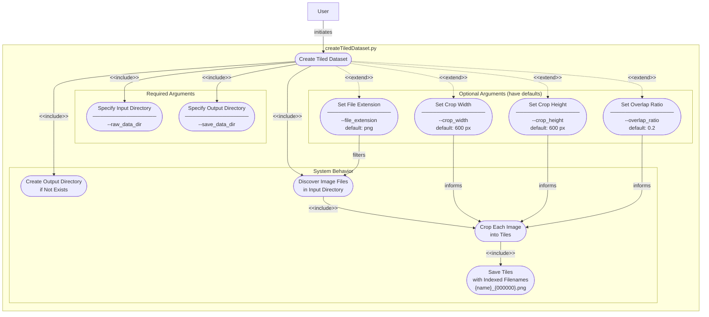

# UML Use Case Diagrams

Use case diagrams documenting the user-facing functionality of each top-level script.

---

## `createTiledDataset.py`

Crops large orthorectified images into fixed-size tiles for use as training/validation data.

### Key Behaviors

| Argument | Required | Default | Description |
|---|---|---|---|
| `--raw_data_dir` | Yes | — | Directory containing source images to tile |
| `--save_data_dir` | Yes | — | Directory where tiles will be written |
| `--file_extension` | No | `png` | File extension used to glob input images |
| `--overlap_ratio` | No | `0.2` | Fractional overlap between adjacent tiles (0 = no overlap) |
| `--crop_width` | No | `600` | Tile width in pixels |
| `--crop_height` | No | `600` | Tile height in pixels |

**Output filename pattern:** `{original_name}_{index:06d}.png`
**Side effect:** Output directory is created automatically if it does not exist.

---
